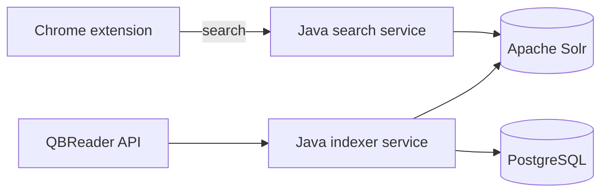

# QBAlways

QBAlways is a search platform for quizbowl questions. Select text on any webpage and the Chrome extension returns ranked occurrences from an Apache Solr index built from the public [QBReader API](https://www.qbreader.org/tools/api-docs/).

The project pairs a useful browser workflow with the infrastructure behind it: two Java microservices, a rate-limited batch indexing pipeline, Lucene-based relevance ranking, PostgreSQL run metadata, health endpoints, tests, and a containerized development environment.



## What it demonstrates

- Search infrastructure with Solr/Lucene, BM25 ranking, phrase boosts, filters, facets, and highlighting
- An idempotent batch pipeline with upstream rate limiting, retries, bounded development runs, and durable run metadata
- Independently deployable Java 21 and Spring Boot services with stable HTTP contracts
- SQL-backed operational state in PostgreSQL
- Production concerns including query validation, backpressure, health checks, non-root containers, and graceful client fallback
- An explicit path from batch ingestion to Kafka/Flink if the source eventually provides change events

## Run the platform

Docker Desktop is the only prerequisite.

```powershell
docker compose up --build -d
```

Index one recent QBReader set as a quick development dataset:

```powershell
$run = Invoke-RestMethod -Method Post "http://localhost:8081/api/index/sync?maxSets=1"
Invoke-RestMethod "http://localhost:8081/api/index/runs/$($run.runId)"
```

Search the index:

```powershell
Invoke-RestMethod "http://localhost:8080/api/search?q=mitochondria&size=5"
```

Run the end-to-end smoke test after the containers start:

```powershell
./scripts/smoke-test.ps1
```

Run a small concurrent search benchmark:

```powershell
python ./scripts/benchmark_search.py --requests 200 --concurrency 20
```

Set `maxSets=0` to index every set. The indexer stays below QBReader's published 20-request-per-second limit; a full first-time load can therefore take a while.

## Install the extension

1. Open `chrome://extensions`.
2. Enable **Developer mode**.
3. Click **Load unpacked** and choose this repository folder.
4. Select text on a webpage and click **Search QBReader**, or use the selection context menu.

The extension prefers the ranked local search service at `http://localhost:8080`. If that service is unavailable or has no matching indexed documents, it falls back to QBReader's public query API so the core workflow still works.

## API examples

The search service supports question type, search field, category, difficulty, year range, exact phrase mode, and pagination:

```text
GET /api/search?q=mitochondrial+Eve
    &type=TOSSUP
    &within=QUESTION
    &category=Science
    &difficulty=5
    &minYear=2020
    &exact=false
    &page=0
    &size=20
```

The indexer exposes asynchronous run control and status:

```text
POST /api/index/sync?maxSets=1
GET  /api/index/runs/{runId}
GET  /api/index/runs
```

## Engineering notes

- [Architecture and failure behavior](docs/architecture.md)
- [Why the source is ingested as a batch](docs/decisions/001-batch-ingestion.md)
- [Why Solr sits behind a Java API](docs/decisions/002-solr.md)

## Tests

The Java tests verify query construction, input escaping, field weighting, filtering, and QBReader-to-Solr document transformation. CI also validates the extension's JavaScript and manifest.

```powershell
docker run --rm -v "${PWD}/backend:/workspace" -w /workspace maven:3.9-eclipse-temurin-21 mvn verify
```

QBAlways is an independent project and is not affiliated with QBReader.
