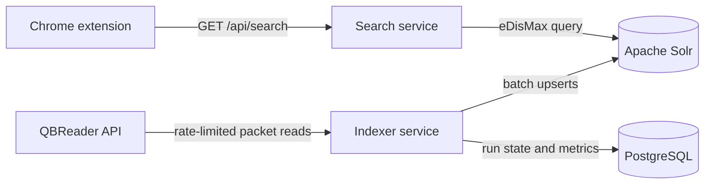

# QBAlways architecture

QBAlways turns selected webpage text into ranked quizbowl question results. The product is split into a browser client, an online query path, and an asynchronous ingestion path so each component can scale and fail independently.

## Request path

The Java search service owns the public search contract. It validates inputs, prevents clients from sending arbitrary Solr query syntax, and translates product-level filters into Solr parameters. Solr uses BM25-based full-text ranking through eDisMax with these initial relevance choices:

- Answerline matches receive more weight than question-body matches.
- Full-phrase matches receive a large boost.
- Two-word phrase matches receive a smaller boost.
- Non-exact queries require at least 70% of terms to match.
- Results with equal relevance prefer newer sets.

The service returns stable JSON containing ranked hits, safe highlight markers, query time, pagination metadata, and category facets. Solr remains on a private network and is not exposed to the extension in a production deployment.

## Indexing path

The indexer retrieves QBReader's expanded set list, walks each set packet by packet, converts tossups and bonuses into a shared search-document shape, and performs idempotent Solr upserts. It deliberately stays below QBReader's published request limit and retries transient failures with exponential backoff.

Every run is recorded in PostgreSQL with its state and progress counters. Only one run can execute per indexer instance. A production deployment with multiple indexer replicas would replace the in-memory guard with a PostgreSQL advisory lock or a distributed lease.

Documents use stable IDs such as `tossup:<qbreader-id>` and `bonus:<qbreader-id>`, allowing a failed run to restart without creating duplicates. Updates use `commitWithin` to avoid a hard commit for every packet, followed by one explicit commit when a run completes.

## Failure behavior

| Failure | Behavior | Production extension |
|---|---|---|
| Solr unavailable | Search service returns HTTP 503 | Retry with jitter; use QBReader fallback |
| QBReader rate limit or 5xx | Indexer retries with exponential backoff | Add capped retries and dead-letter run metadata |
| Indexing process restarts | Existing documents remain queryable | Resume from persisted set/packet checkpoint |
| Bad source document | Current run fails visibly | Quarantine individual records and continue |
| PostgreSQL unavailable | New ingestion does not start | Keep serving the last committed Solr index |

## Scaling path

The first deployment should use one Solr node because the corpus and request rate do not justify a cluster. Search-service replicas are stateless and can scale horizontally behind a load balancer. If index size or availability requirements outgrow a node, the collection can move to SolrCloud with replicas and shards without changing the extension contract.

If QBReader later provides an event stream, the indexing boundary can accept events through Kafka and use Flink for stateful deduplication and enrichment. Today, scheduled batch ingestion is simpler and more reliable because the source exposes HTTP snapshots rather than ordered change events.

## Security and operability

- The extension never receives Solr or PostgreSQL credentials.
- The indexer control API is a local-development surface; a deployed version belongs on a private network or behind operator authentication.
- User query syntax is escaped and explicit field queries are disabled.
- Public parameters have length, range, and page-size limits.
- Actuator exposes health and metrics endpoints for both Java services.
- The indexer records durable run progress and error messages.
- Containers run the Java services as non-root users.
